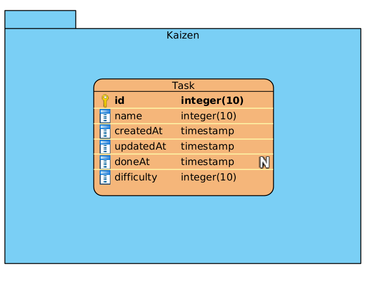

### Introduction:
This document describes the design of a desktop application that reminds the user with a certain set of daily tasks to be done.

The philosophy behind this application follows kaizen principle: continued small improvement every day.
Therefore, for the user to benefit from this app, The tasks should be easy to do (This is up to the user), and they should
be limited to a certain small number (2 or 3 tasks per day) 

### functional analysis:
- Add tasks.
- Set task difficulty.
- Only allow a certain sum of difficult tasks per day: To keep the tasks easy.
- edit current tasks.
- Mark tasks as done.
- At the end of the day, save the done/undone tasks.
- Show a history of the done/undone tasks.
- provide auto-complete when typing tasks using the old tasks.
- prompt notification on a custom time to remind user of left tasks.
- [wanted] Backup history of tasks and link it to a Google drive.

### Database:
To keep things simple the database model.
